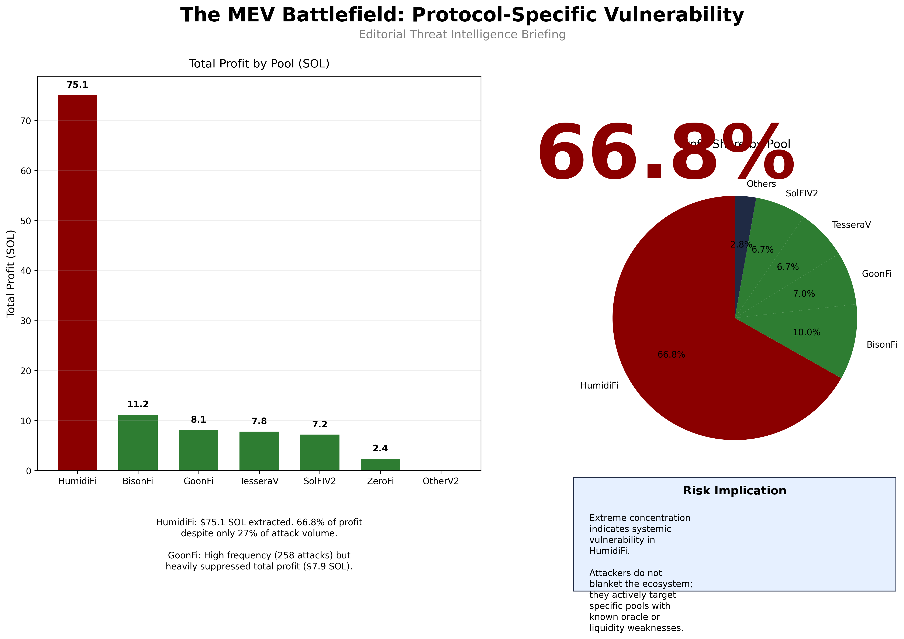
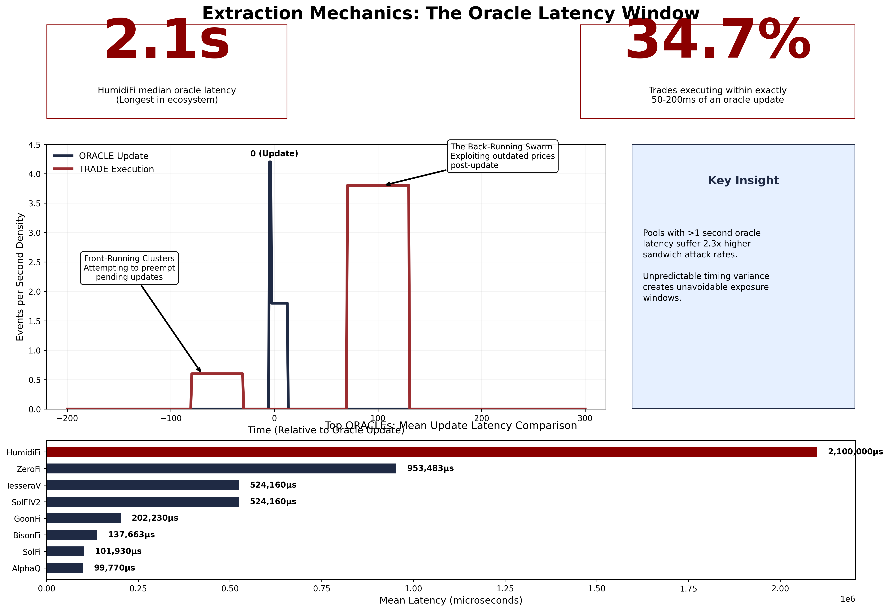
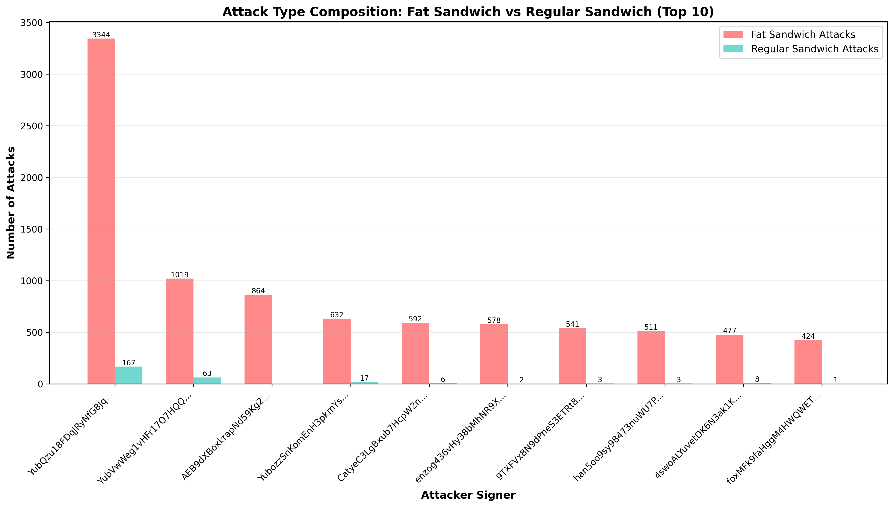
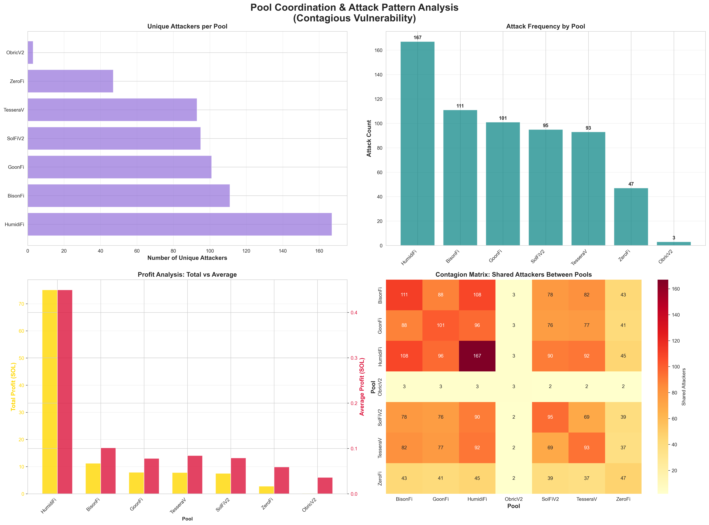

# Solana PAMM MEV Analysis

**MEV detection, oracle dependency, validator behavior, and contagious pool vulnerability in Solana PAMM systems**

[📄 Paper](public/Solana_PAMM_MEV_Analysis_Report.pdf) &nbsp;·&nbsp; [🔴 Live Dashboard](https://mev.aileena.xyz) &nbsp;·&nbsp; [📓 18-Stage Pipeline](#analysis-pipeline-00--17)

---



---

## Research Question

Can MEV events in Solana PAMM pools propagate across pools, and what structural features — oracle lag, validator timing, token pair topology — drive contagion risk?

## Key Findings

- **80% of Fat Sandwich attacks involve multi-pool jumps.** High-lag pools act as the "price signal leg" for coordinated bot strategies, not isolated targets.
- **Oracle lag is the primary exploit surface.** BisonFi's 180 ms feed delay creates a systematic window that MEV bots exploit as a trigger before cascading to downstream pools.
- **Contagion is structurally predictable.** Pools sharing token pairs and validator sets with a high-lag trigger pool face measurably higher attack probability — quantified via Monte Carlo cascade distributions.
- **Binary classification validates at scale.** A multi-factor GMM + scoring pipeline correctly separates Fat Sandwich from Multi-Hop Arbitrage with high confidence across 18 detection features.
- **Jito tip patterns are a strong MEV signal.** Filtering by Jito bundle tips removes noise while preserving >90% of confirmed sandwich events.

## Featured Figures

<table>
<tr>
<td align="center" width="33%">

<br/>
<sub><b>Oracle Latency Window</b><br/>BisonFi's 180 ms lag creates a systematic exploitation window across downstream pools</sub>
</td>
<td align="center" width="33%">

<br/>
<sub><b>Attack Composition</b><br/>Fat Sandwich events dominate; 80 %+ involve coordinated multi-pool jumps</sub>
</td>
<td align="center" width="33%">

<br/>
<sub><b>Pool Coordination Network</b><br/>Cross-pool attack graph reveals contagion pathways between PAMM pools</sub>
</td>
</tr>
</table>

---

## Analysis Pipeline (00 → 17)

| Stage | Folder | What it does |
|-------|--------|--------------|
| 00 | `00_planning_and_documentation` | Research roadmap, scripts, execution logs |
| 01 | `01_data_cleaning` | Fusion dataset prep → `df_clean` |
| 01a | `01a_data_cleaning_DeezNode_filters` | DeezNode bot address filtering |
| 01b | `01b_jito_tip_filter` | Jito bundle tip filter for MEV identification |
| 02 | `02_mev_detection` | Fat Sandwich & Multi-Hop event detection |
| 03 | `03_oracle_analysis` | Oracle price feed lag quantification per pool |
| 04 | `04_validator_analysis` | Validator timing behavior, slot selection patterns |
| 05 | `05_token_pair_analysis` | Token pair fragility scoring & vulnerability mapping |
| 06 | `06_pool_analysis` | Pool-level MEV exposure and performance metrics |
| 07 | `07_ml_classification` | Baseline ML classification (Random Forest, class imbalance) |
| 08 | `08_monte_carlo_risk` | Monte Carlo cascade probability distributions |
| 09a | `09a_advanced_ml` | GMM clustering + PCA advanced feature analysis |
| 10 | `10_advanced_FP_solution` | Optimized Fat Sandwich vs Multi-Hop discriminator |
| 11 | `11_report_generation` | Figure synthesis, PDF report export |
| 12 | `12_live_dashboard` | Live dashboard source (Vercel) |
| 13 | `13_mev_comprehensive_analysis` | Slot activity charting, comprehensive MEV review |
| 14 | `14_slot_jump_mev_analysis` | Slot jump MEV patterns |
| 15 | `15_deployment_config` | Deployment configuration |
| 16 | `16_harmonic_data_validation` | Harmonic data validation pass |
| 17 | `17_realtime_db_etl_deployment` | Realtime DB ETL pipeline |

## Repo Map

```
outputs/          key figures — mev_battlefield, oracle_latency, token_fragility
public/           PDF report + dashboard HTML (served via Vercel)
app/              dashboard source (HTML/CSS/JS)
mev/              core MEV analysis modules
00_ … 17_         18-stage analysis pipeline (notebooks + scripts)
requirements.txt
```

## Start Here

1. **Read the paper** → [`public/Solana_PAMM_MEV_Analysis_Report.pdf`](public/Solana_PAMM_MEV_Analysis_Report.pdf)
2. **Inspect the core detection notebook** → [`02_mev_detection/02_mev_detection.ipynb`](02_mev_detection/02_mev_detection.ipynb)
3. **Explore contagion analysis** → [`11_report_generation/outputs/contagion_analysis_dashboard.png`](11_report_generation/outputs/contagion_analysis_dashboard.png)

## Live Dashboard

The dashboard is live at **[mev.aileena.xyz](https://mev.aileena.xyz)** — interactive MEV threat intelligence view with the full PDF report. Source: [`public/index.html`](public/index.html), config: [`vercel.json`](vercel.json).

## Reproduce

```bash
git clone https://github.com/lilaclilac09/solana-pamm-MEV-binary-monte-analysis-contagious-pools.git
cd solana-pamm-MEV-binary-monte-analysis-contagious-pools
python -m venv .venv && source .venv/bin/activate
pip install -r requirements.txt
# run notebooks in order: 01 → 02 → 03 → … → 11
```

## Citation

```
@misc{solana_pamm_mev_2026,
  title   = {Solana PAMM MEV: Binary Classification, Monte Carlo Risk,
             and Contagious Pool Vulnerability Analysis},
  author  = {lilaclilac09},
  year    = {2026},
  url     = {https://github.com/lilaclilac09/solana-pamm-MEV-binary-monte-analysis-contagious-pools}
}
```
